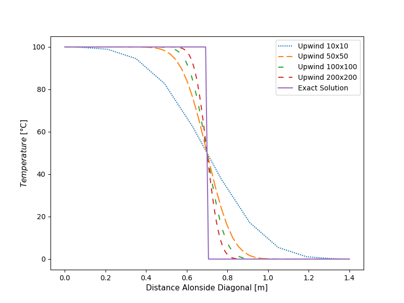

# False Diffusion

The upwind differencing scheme causes
the distributions of the transported properties to become smeared in such
problems. The resulting error has a diffusion-like appearance and is referred
to as **false diffusion**.

we have a domain where u = v = 2 m/s everywhere so the
velocity field is uniform and parallel to the diagonal (solid line) across the
grid. The boundary conditions for the scalar are φ = 0 along the south and
east boundaries, and φ = 100 on the west and north boundaries. At the first
and the last nodes where the diagonal intersects the boundary a value of 50
is assigned to property φ.

To identify the false diffusion due to the upwind scheme, a pure convection process is considered without physical diffusion. There are no source
terms for φ and a steady state solution is sought. The correct solution is
known in this case. As the flow is parallel to the solid diagonal the value of
φ at all nodes above the diagonal should be 100 and below the diagonal it
should be zero.
The error is largest for the coarsest grid, and the figure shows that
refinement of the grid can, in principle, overcome the problem of false
diffusion. The results for 10 x 10 and 50 × 50 and 100 × 100 and 200 x 200 grids show profiles that
are closer to the exact solution.

